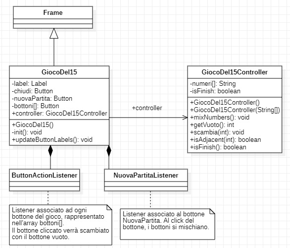

# Gioco Del Quindici

## Il Gioco

Il gioco del quindici e' un rompicapo classico creato nel 1874 da Noyes Palmer Chapman, postino in servizio a Canastota, e popolarizzato nel 1880 da Samuel Loyd. 
Il gioco consiste di una tabellina di forma quadrata, solitamente di plastica, divisa in quattro righe e quattro colonne (quindi 16 posizioni), su cui sono posizionate 15 tessere quadrate, numerate progressivamente a partire da 1. 
Le tessere possono scorrere in orizzontale o verticale, ma il loro spostamento e' ovviamente limitato dall'esistenza di un singolo spazio vuoto. 
Lo scopo del gioco e' riordinare le tessere dopo averle "mescolate" in modo casuale (la posizione da raggiungere e' quella con il numero 1 in alto a sinistra e gli altri numeri 
a seguire da sinistra a destra e dall'alto in basso, fino al 15 seguito dalla casella vuota).
 

## Linguaggio di programmazione utilizzato

Ho implementato il gioco descritto sopra usando il linguaggio di prorammazione Java. 
Qui sotto la schermata del gioco.

## Architettura del gioco
 
Il gioco e' suddiviso in due classi principali. La classe GiocoDel15Controller racchiude la logica del gioco mentre la classe GiocoDel15 e' la classe java responsabile per i componenti grafici.

 
 
In sintesi l'implementazione del gioco e' la seguente: 
Ad ogni click del bottone verifico: 
1. Se e' adiacente al bottone vuoto. 
	1. scambia il bottone cliccato con quello vuoto. 
2. verifico se la combinazione dei numeri e' quella finale 
	1. a questo punto il gioco si blocca e fa vedere la scritta "HAI VINTO!!!" 
3. Per ricominciare bisogna cliccare su NuovaPartita. 

## Avvio del gioco
Per poter lanciare il gioco scaricare il `jar` nella cartella [GiocoDel15/dist/](./dist) e lanciarlo facendo il doppio click.

## See 

* [Gioco del Quindici](https://it.wikipedia.org/wiki/Gioco_del_quindici) - Descrizione del gioco in Wikipedia
* [Class Diagram uml](https://www.visual-paradigm.com/guide/uml-unified-modeling-language/uml-class-diagram-tutorial/) - Come creare un Class Diagram con uml
* [Operatore %](https://www.baeldung.com/modulo-java) - Operatore modulo e suoi utilizzi
* [Incapsulamento](https://www.w3schools.com/java/java_encapsulation.asp#:~:text=The%20get%20method%20returns%20the%20value%20of%20the%20variable%20name,refer%20to%20the%20current%20object.) - Concetto di incapsulamento 